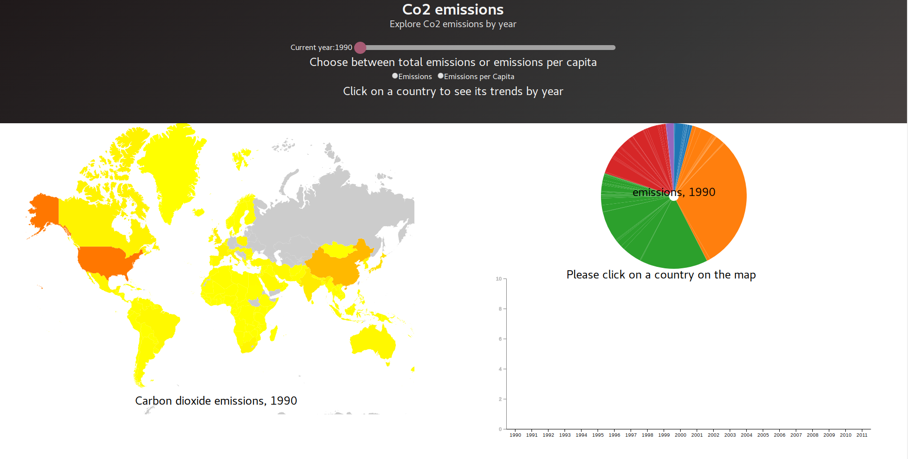
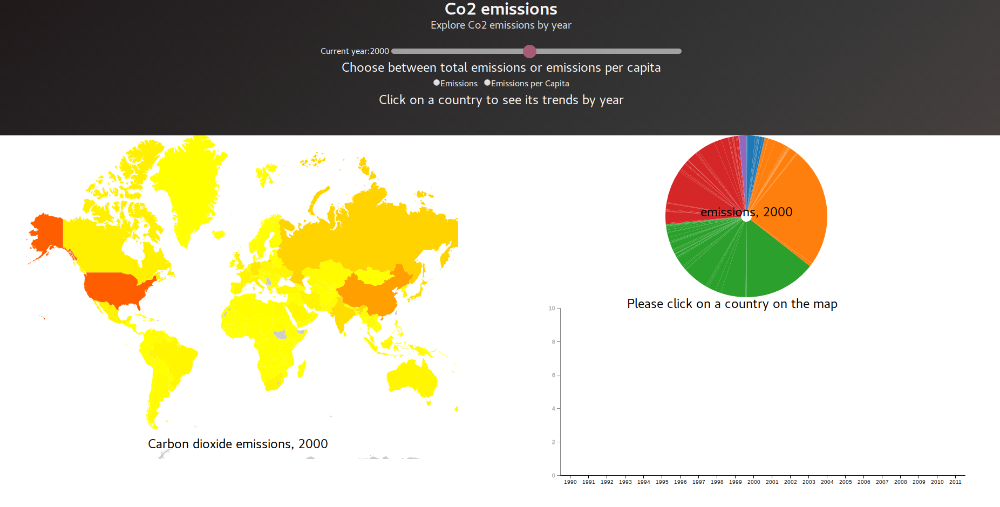
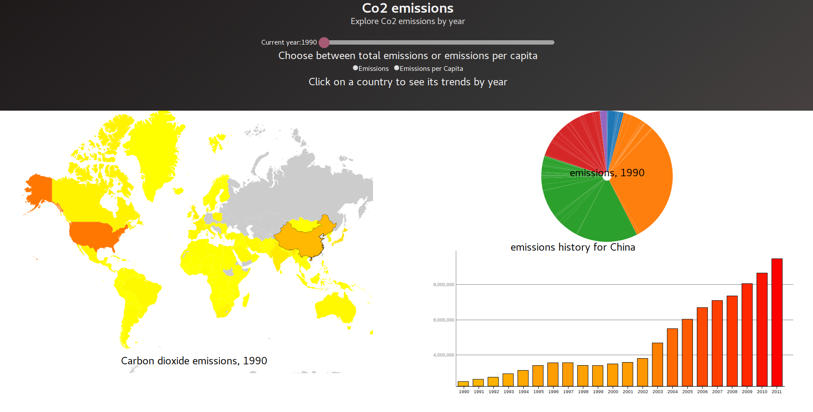
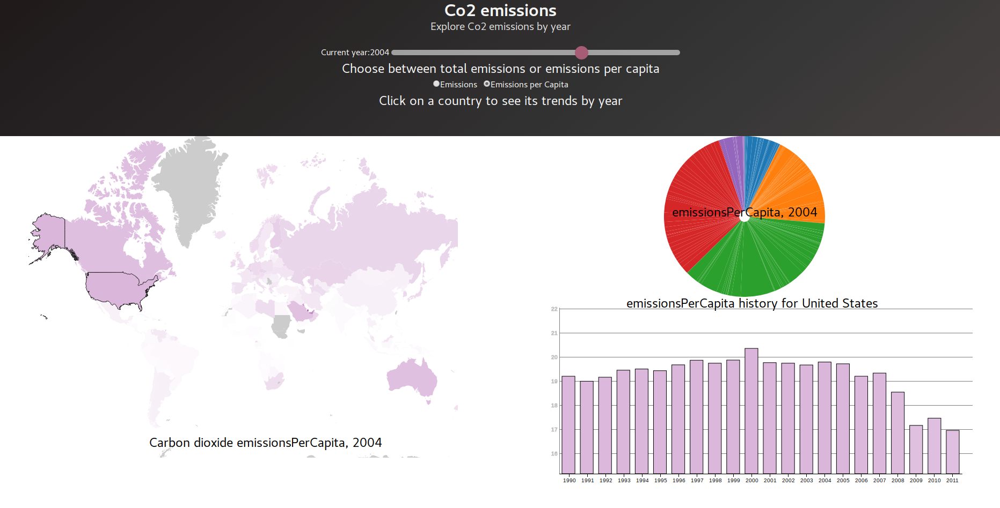

# d3-dashboard
A d3 dashboard showing CO2 emissions by various countries from 1990-2011.

This dashboard was implemented in pure d3 and uses topojson for the map visualization. Bulma css is used to style the header. Transitions in the visulization are smooth thanks to `d3-transition` and `d3-ease`.

## Data
The data that is being visualized in the dashboard was obtained [here](http://data.un.org/)

## Live Demo
The live demo can be found here:
[Live Demo](https://dileep-kishore.github.io/d3-dashboard)

## Screenshots

 Main dashboard page that is shows when you load the page 

 You can change the year 

 You can choose to look at emissions per capita 

 You can click on a country to see it's early trend in the bar chart 

